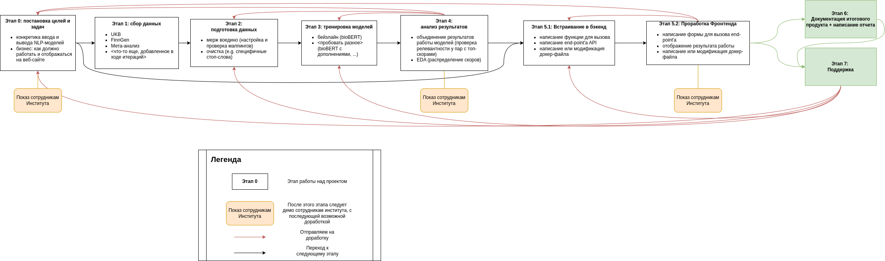
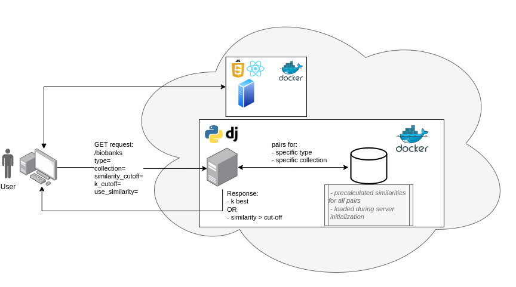

# Поиск информации и данных по медицинским коллекциям и видам болезней
## Дизайн ML системы

*При составлении данного документа был использован Шаблон [ML System Design Doc](https://github.com/IrinaGoloshchapova/ml_system_design_doc_ru/blob/main/ML_System_Design_Doc_Template.md) от телеграм-канала [Reliable ML](https://t.me/reliable_ml)*   

Работа проведена при поддержке Проекта № 15.BRK.21.008 «Многоцентровая исследовательская биоресурс-
ная коллекция «Репродуктивное здоровье человека» (соглашение № 075-15-2021-1058 от 28. 09. 2021), финансируемого Министерством 
науки и высшего образования РФ.

### 1. Цели и предпосылки 
#### 1.1. Зачем идем в разработку продукта?  

- **Бизнес-цель**: выдача релевантных исследований и статей по запросу (коллекция/тип образца).
- **Почему станет лучше, чем сейчас, от использования ML**: 
    - автоматизация поиска релевантных исследований и данных;
    - следовательно пользователи без усилий смогут выяснить, что из себя представляют хранящиеся в биобанке образцы/коллекции.
- **Что будем считать успехом итерации с точки зрения бизнеса**: 
    - работающая МЛ-часть;
    - встроенный в текущий веб-интерфейс модуль.

#### 1.2. Бизнес-требования и ограничения  

- **Ссылки на детальные документы с бизнес-требованиями**:
    - [Документ с критериями оценивания проектного семинара](https://adhesive-burst-49c.notion.site/94924045b7844805a43827833ec3cfa7)
    - [Текущая внешняя система без МЛ-системы](http://51.250.91.100:3000/)
    - [Первая презентация с идеей проекта](https://docs.google.com/presentation/d/1gku94mMuG7_RfxKHqnXF5-1ZWGj5Nyu7GWxABMgm2xg/edit?usp=sharing) от 20.11.2023. 
    - [Документ с описанием доступных данных](https://docs.google.com/document/d/1EuJOx2iu7zVLVzkMqsKDPozVCgrZC16H6VQHH6hOCOs/edit?usp=sharing)
    - [Финальная презентация]() (будет загружена позже). 
    - [Гитхаб репозиторий с проектом и ридми](https://github.com/TohaRhymes/med_nlp).
- **Бизнес-ограничения**: 
    -  быстродействие системы (загрузка меньше нескольких секунд);
    -  в данный момент есть фиксированный список типов коллекций и болезней, в будущем могут дополняться.
- **Ожидания от итерации**: 
    - МЛ-система, выдающая релевантные исследования (статьи, ссылки на международные биобанки), а также сводные статистики этих исследований (...`КОНКРЕТИЗИРОВАТЬ`).
    - система должна быть встроена в текущий веб-интерфейс с возможной доработкой пользовательской и серверных частей (фронт- и бэк- энда).
- **Описание бизнес-процесса пилота**:
    - модель будет использоваться в текущей открытой системе Института для просмотра сводных статистик о хранящихся в коллекции образцах;
    - пользователь будет выбирать коллекции и типы образцов, для которых необходимо предоставить релевантные исследования и конкретные признаки из следующих мест:
        - британский биобанк (UK Biobank)
        - Финский биобанк (FinnGen)
        - Их метаанализ (Uk Biobank + Finngen)
- **Критерии успеха и возможные пути развития проекта**
    - модель матчит коллекции/образцы с **релевантными** исследованиями (субъективная оценка);
    - модель встроена в веб-интерфейс (обязательно).
    - в веб-интерфейсе существуют функции выбора конкретных коллекций/образцов, а так же количества отображаемых найденных исследований.

#### 1.3. Что входит в скоуп проекта/итерации, что не входит   

- **На закрытие каких БТ подписываемся в данной итерации**:
    - матчинг по схожести;
    - встраивание модели в систему (в дальнейшем все модели будут встраиваться аналогично).
- **Что не будет закрыто**:
    - поиск релевантных фрагментов в абстрактах статей.
- **Описание результата с точки зрения качества кода и воспроизводимости решения**:
    - jupyter-ноутбуки или python-скрипты должны быть подробно описаны и задокументированы;
    - в отдельных файлах должны быть прописаны зависимости;
    - отдельно должны быть предоставлены фрагменты программ для встраивания модели в текущую систему (согласно языкам и фреймворкам серверной и клиентской части).

#### 1.4. Предпосылки решения  

- Описание всех общих предпосылок решения, используемых в системе – с обоснованием от запроса бизнеса: какие блоки данных используем, горизонт прогноза, гранулярность модели, и др. `Data Scientist ?????????????`  

### 2. Методология 

#### 2.1. Постановка задачи  

- *Что делаем с технической точки зрения*: 
    - Ранжирование: для каждого названия коллекции образца проранжировать все имеющиеся признаки и исследования и выбрать N наиболее релевантных.  

#### 2.2. Блок-схема решения  

 

#### 2.3. Этапы решения задачи `Data Scientist`  

    
**Этап 0 - Постановка целей и задач**

Этот этап активного обсуждения с Заказчиком (сотрудниками и руководителем Института), изучения требований с их стороны, и со стороны гранта. В этот этап возвращаемся при пересмотре требований после демонстраций на этапах 4 и 5.2.

*Вводные:* ТЗ от Института Отта согласно гранту, что необходимо сконструировать с точки хрения функциональности, требования по внутренней реализации, возможности интеграции в существующее решение

*Техника предполагаемого решения:* обсуждение с заказчиком (медиками Института, начальником коллектива, предполагаемыми пользователями), перевод бизнес требований и требований Гранта в технический язык.

*Что ожидаем получить на выходе:* конкретный формат ввода и вывода, желаемое отображение, используемые данные. 

*В результате выполнения этого этапа, было выяснено, что* программа должна работать на базе уже существующего решения веб-приложения:
    - необходимо создать новую веб-страницу с похожей функциональностью;
    - должны быть фильтры по коллекциям и типам образцов (чек-боксы);
    - должны быть слайдеры для выбора количества отображаемых результатов (как по схожести, так и по количеству).

**Этап 1 - Сбор данных**

*Вводные:* Конкретные предполагаемые источники. В результате обсуждений этими источниками оказались: веб-сайты проектов UKB и Finngen (см. выше).

*Техника предполагаемого решения:* изучение целевых веб-сайтов, поиск ссылок, скачивание, изучение таблиц.

*В результате выполнения этого этапа*: 
* были скачаны три основные таблички (более подробное описание в readme данного репозитория), которые содержать коды признаков, короткие названия, описания, а также маппинги для сопоставлений мета-анализа.
* были подготовлены сопоставления коротких кодов и названий на русском и английском языках коллекций и типов образцов, хранящихся в биобанке (предоставлены Институтом).

**Этап 2 - Подготовка данных**

*Вводные:* Три таблицы (далее может измениться) с признаками из исследований, сопоставления кодов и названий болезней и коллекций Института. 

*Техника решения:* 
* объединение данных согласно кодам и маппингам, фильтрация, 
* также (как выяснилось позже), существует ряд слов, который не несет смысла - стоп-слова, их необходимо было удалить из всех предложений ('Disease(s) of', 'Disorder(s) of', 'Question')

*В результате выполнения этого этапа*, были получены две таблицы:
* `data/merged_bio.tsv` - смерженные данные, колонки соответствуют кодам, описанию и названиям признаков из исследований.
* `data/codes.tsv` - текущие названия из биобанков (коллекций и признаков) на русском, английском языках, а также их внутренний код.

**Этап 3 - тренировка моделей**

*Вводные:* две таблицы из прошлого этапа (данные в будущем могут дополняться). 

*Техника решения:* 
* изучить необходимые модели
* выбрать наиболее подходящие, с подходящими техниками (предобработки)
    * BERT
    * bioBERT
    * BERT & bioBERT + стоп-слова
* на полученных от моделей эмбеддингах посчитать:
    * косинусное расстояние 
    * ???
* сохранить и смержить результаты

*В результате выполнения этого этапа*, были получены оценки близости между признаками исследований и хранящимися в биобанке образцами, примерный вид таблицы:

| biobank_feature | ukb_feature | ukb_similarity_score1 | ukb_similarity_score2 | ... | fg_feature | fg_score1 | ukb_similarity_score2 | ... |
|-----------------|-------------|-----------------------|-----------------------|-----|------------|-----------|-----------------------|-----|
|                 |             |                       |                       |     |            |           |                       |     |
|                 |             |                       |                       |     |            |           |                       |     |
|                 |             |                       |                       |     |            |           |                       |     |

**Этап 4 - анализ результатов**

*Вводные:* оценки близости, полученные вышеописанными способами.

*Техника решения:* 
* определить "мусор" (условный трешхолд, начиная с которого матчатся нерелевантные термины):
    * с помощью гистограммы распределения скоров
    * с помощью экспертной оценки (обсуждения с коллегами из института на соответствие бизнес требованиями)
* выбрать лучшие, при необходимости (плохом матчинге) повторить вышестоящие этапы с другими моделями/на других параметрах.

*В качестве результатов этапов 2-4, предоставлены*:
* jupyter-ноутбуки или python-скрипты с подробными описаниями, а так же файлом `requirements.txt` для:
    * сбора и предобработки данных;
    * обучения модели

**Этап 5.1 - встраивание в бэкенд**

Так как данные таблички получены, в продакшне (в системе) их необходимо только фильтровать по заданным коллекциям/признакам и выдавать лучшие k/те у кого коэффициент схожести больше определенного. Таким 
* модель в оффлайне сопоставляет запросы (коллекции и образцы) с исследованиями (предпосчитано на предыдущих этапах), а затем в онлайне по подсчитанному скору выводит необходимое число лучших соответствий;
* данные предпосчитаны, 
* *Необходимо*: написать функцию для бэкенд, 

*В качестве результата должен быть представлен*:
* python-код end-point'a для использования модели на серверной части системы (ЯП: Python; фреймворк: Django)

**Этап 5.2 - проработка фронтенда**

*Вводные:* 
* формат ввода и вывода энд-поинта, написанного на предыдущем 

*В качестве результата должен быть представлен*:
* JS-код для отрисовки табличных данных, а также формы запроса на клиентской части системы (фреймворк:  React + Bootstrap 5)

* После этих этапов, предварительный продукт снова можно показывать заказчику, собирать вопросы комментарии, планировать переделки*.

* *Для дальнейшего разворачивания для обоих компонентов по возможности необходимо написать докер-файлы (раньше их не было).*

**Этап 6 - документация итогового продукта и написание отчета**

*Вводные*: готовый продукт.

*В качестве результата должы быть представлены*:
* дизайн-документация продукта (данный документ)
* один (или несколько) репозиториев с кодом и описанием работающего продукта; 
    * в данном случае это несколько репозиториев: с мл-частью, а также контрибуция в репозитории веб-части проекта.

**Этап 7 - поддержка**

*Вводные*: готовый продукт, документация.

У этого этапа *нет конечного результата*, но при выявлении неполадок, или при дополнительных нуждах заказчика, необходимо вернуться к любому из этапов и переделать необходимые шаги (как ML-части, так и веб-части).

  
### 3. Подготовка пилота  

* Таблицы с сопоставлениями можно согласовывать отдельно;
* Демонстрацию работающего продукта можно провожидть на локальной машине;
* Итоговый продукт должен быть развернут на инфраструктуре университета (для этого были написаны докер-файлы).

После этого, была проведена демонстрация с возможностью пилотного испытания внутри университета.
  
#### 3.1. Способ оценки пилота  
  
Оценка производится заказчиком по предполагаемым критериям:
* удобство пользования.
* корректность выводлимых результатов.
  
#### 3.2. Что считаем успешным пилотом  
  
подтверждение корректности работы заказчиком.

### 4. Внедрение

### 4. Внедрение

#### 4.1. Архитектура решения   

 
  
Архитектура стандартна для клиент-серверного решения, есть фронтэнд (клиентская часть) и бэкенд (серверная часть), пользователь переходит по порту, на котором развернута фронтенд часть приложения, и при навигации по сервису происходят запрос на серверную часть.
- клиентская часть написана на Java Script с использованием фреймворков React (v18) и Bootstrap (v5), развернута на сервере Института с использованием подготовленного Docker-файла.
- серверная часть написана на Python 3.9 с использованием фрейморка django (v4.1), также развернута на сервере Института с использованием подготовленного Docker-файла.

В ходе выполнения текущего проекта был добавлен один end-pont: `/biobanks`, обращение к которому происхоит путем GET-запроса со следующими параметрами:
* `type` - строка, список через запятую всех запрашиваемых типов;
* `collection` - строка, список через запятую всех запрашиваемых коллекций;
* `similarity_cutoff` - число с плавающей точкой, от 0 до 1, отсечка по схожести;
* `k_cutoff` - целое положительное число, отсечка по количеству выводимых результатов;
* `use_similarity` - логическая переменная, при обрезании результатов использовать схожесть (true), или отсечку по количеству (false). 
 

В качестве ответа возвращается список для формирования таблицы похожих исследований. Формат ответа - json. 

#### 4.2. Описание инфраструктуры и масштабируемости 
  
- Такая инфраструктура выбрана по причине того, что решение и выбор уже были осуществлены ранее: в рамках выполнения данного проекта совершалась лишь работа над дополнительным модулем.
- Плюсы выбора: 
    - нет необходимости переписывать остальную функциональность;
    - возможность переиспользования фрагментов кода/функций. 
- Минусы выбора:
    - пришлось изучать действующую архитектуру ПО. 
    
  
#### 4.3. Требования к работе системы  
  
Специфических требований нет, так как не ожидается большая нагрузка на систему.
  
#### 4.4. Безопасность данных   
  
Нарушений безопасности нет, так как нет персональных данных, все данные публичные и ссылаются на публичные источники.